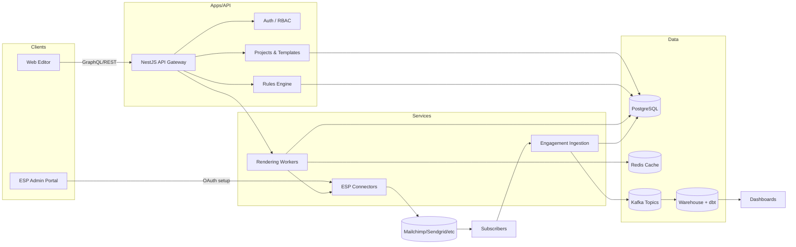

# System Architecture – Interactive Newsletter Engine

## 1. Logical Overview


## 2. Deployment Topology
```mermaid
deploymentDiagram
  node Users {
    component Browser
  }
  node Cloud {
    node Cluster {
      component WebApp
      component ApiGateway
      component RendererWorkers
      component IngestionSvc
      component IntegrationsSvc
    }
    database Postgres
    database Redis
    component Kafka
    component Warehouse
  }
  Browser --> WebApp
  WebApp --> ApiGateway
  ApiGateway --> Postgres
  ApiGateway --> Redis
  ApiGateway --> RendererWorkers
  RendererWorkers --> Redis
  RendererWorkers --> IntegrationsSvc
  IntegrationsSvc --> ExternalESPs
  IngestionSvc --> Kafka --> Warehouse
```

## 3. Data Flow Steps
1. Editors design templates in the Web app, which calls the NestJS API (Gateway) for CRUD operations.
2. When publishing, the API triggers the Rendering workers to produce AMP/HTML outputs and store cache entries in Redis plus metadata in PostgreSQL.
3. Integrations service pushes rendered payloads into connected ESPs using stored OAuth credentials.
4. Subscriber interactions hit the Ingestion API, land in Kafka, then persist into PostgreSQL for audit and replicate downstream to the warehouse for analytics.
5. Analytics dashboards consume warehouse tables built via dbt to feed insights back to the editor.

## 4. Tech Stack Mapping
| Layer | Technologies |
| --- | --- |
| Frontend | React + Vite, Zustand, React Query |
| API | NestJS, TypeScript, GraphQL/REST |
| Services | Node.js workers (BullMQ/Fastify), Kafka producers/consumers |
| Data | PostgreSQL, Redis, Kafka, dbt + BigQuery/Snowflake |
| Auth | Auth0, tenant-scoped RBAC |
| Observability | OpenTelemetry, Prometheus, Grafana, ELK |

## 5. Open Items
- Finalize hosting choice (Kubernetes vs ECS) and CI/CD topology.
- Define sizing for Redis/Kafka clusters per tenant volume targets.
- Document failover strategy for renderer + ingestion services.
